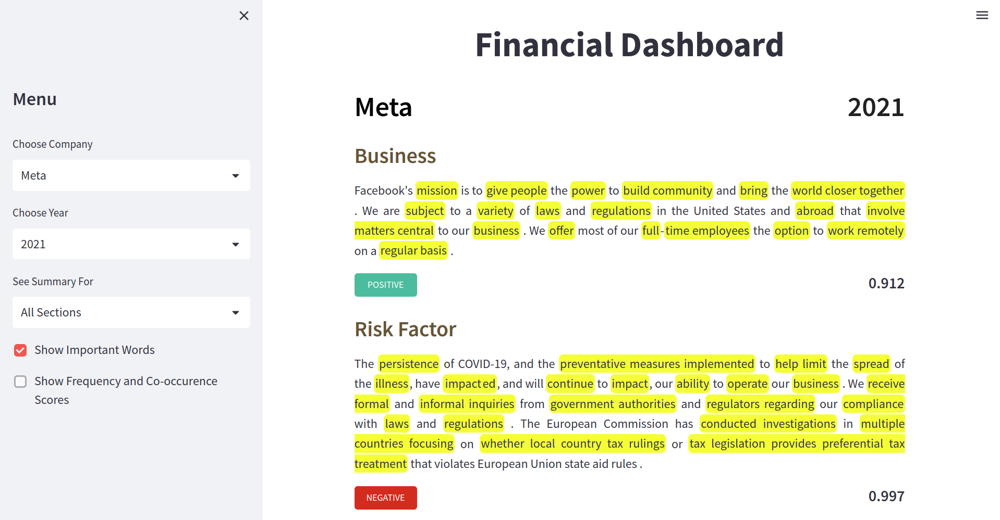
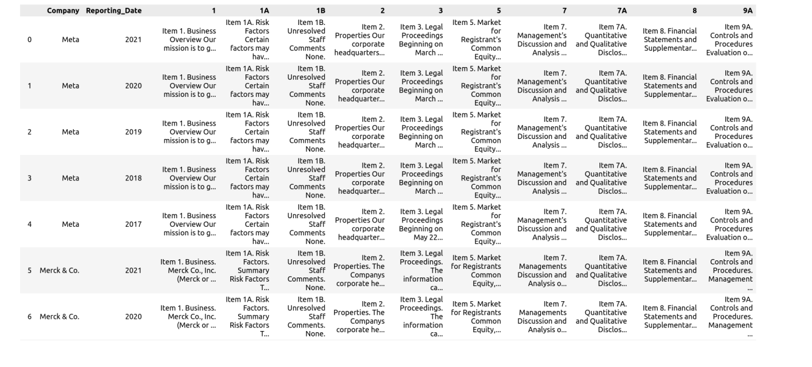

# Financial Dashboard for Market Intelligence

- Built a end-to-end financial dashboard that collects and consolidates all of a business's critical observations in one place using the information obtained from the annual 10-K SEC Filings of 12 companies.

- Collected text data from 10-K filings from SEC EDGAR using the [SEC ExtractorAPI](https://sec-api.io/). 

- The filings of 12 companies spanning 5 sectors were collected for the duration of 2017 to 2021. Each filing had over 34,000 words.

- The data was cleaned and transformed for Sentiment Analysis and Summarization. The data was manually labelled for both the tasks.

- The **RoBERTa, FinBERT and DistilBERT** models were fine-tuned for sentiment analysis. The best results were obtained using the fine-tuned DistilBERT model. It achieved an **Accuracy of 91.11% and an ROC-AUC Score of 0.972.**

- The **T5, DistilPEGASUS and DistilBART** models were fine-tuned for summarization. The best results were obtained using the fine-tuned DistilBART model. It achieved an **ROUGE-L Score of 67.7%.**

- RAKE NLTK was used to identify important keywords from the generated summaries.

- The Financial Dashboard was deployed as a web-app using Streamlit. It contains:
    - **Insights and summaries** for different sections from annual corporate filings.
    - Identification of **important keywords** mentioned in the report.
    - **Sentiment-based score** that measures the company's performance over a certain time period.

The app can be viewed here: [Financial Dashboard](https://awinml-financial-market-intelligence-app-q6lj0g.streamlit.app/)

## **Data**
To extract the text from the SEC filing, the SEC’s ExtractorAPI was used. The API can extract any text section from 10-Q, 10-K, and 8-K SEC filings, and returns the extracted content in cleaned and standardized text or HTML format.
The twelve companies for which the data has been collected as listed below organized by sector:
1. Pharmaceutical:
Abbvie, Pfizer, Merck
2. Technology:
Alphabet, Meta, Microsoft
3. Retail:
Costco
4. Oil and Natural Gas:
Chevron
5. Food and Beverages:
Coca Cola, Pepsico

Snapshot of the data:
 

## **Sentiment Analysis**
A local cross validation split was created by randomly sampling rows from the records of 12 companies across sectors like Technology, Finance, Retail and Pharma.

<a href="https://github.com/awinml/financial-market-intelligence/blob/main/meta_10K.pdf" class="image fit" > A sample 10k report for Meta can be viewed here</a>

The RoBERTa, FinBERT and DistilBERT models were fine-tuned for sentiment analysis. The best results were obtained using the fine-tuned **DistilBERT** model. It achieved an Accuracy of 91.11% and an ROC-AUC Score of 0.972.

| Model | Accuracy | F1 | AUC |
| ----- | ------ | -------- | ------------------ | 
| Roberta | 0.662 | 0.656 | 0.628 |
| FinBERT | 0.746 | 0.682 | 0.721 | 
| DistilBERT | 0.911 | 0.914 | 0.972 |

## **Summarization**

For the summarization task, the data of Pfizer, Costco and Meta was labeled and used. A local cross validation split was created by randomly sampling rows from the records of these companies.
Text summarization was carried out using these three transformers models:

The T5, DistilPEGASUS and DistilBART models were fine-tuned for summarization. The best results were obtained using the fine-tuned **DistilBART** model. It achieved an ROUGE-L Score of 67.7%.

| Model | ROUGUE-1 | ROUGUE-2 | ROUGUE-L | ROUGUE-LSUM
| ----- | ------ | -------- | ------------------ | ------------------|
| T5| 32.22 | 28.5 | 31.5| 31.5 | 31.5 |
| DistilPEGASUS | 48.32 | 34.48 |43.51| 31.50 |
| DistilBART | 72.28 | 61.15 | 67.70 | 71 |

## **Identifying Important Keywords**

RAKE NLTK was used to identify important keywords from the generated summaries.

<!---
## Why do we need a consolidated Financial Dashboard?
In the current data driven world, it is essential to have access to the right information for impactful decision making. All publicly listed companies have to file annual reports to the government. These consolidated statements allow investors, financial analysts, business owners and other interested parties to get a complete overview of the company. Companies all over the world make key financial decisions based on annually released public filings. 

These corporate filings are rife with complicated legal and financial jargon and make it practically impossible for a layman to understand. In most cases these documents have to be manually read and decoded by people with expert financial and legal understanding. The goal of this project is to develop a tool that automates this tedious procedure and makes it easier to acquire crucial financial information.

The results of the modelling can be found here:

-->

